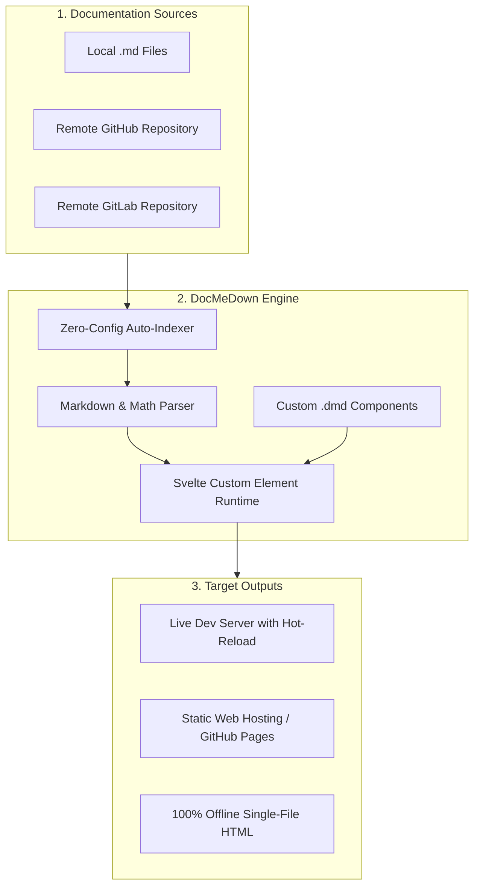

# Welcome to DocMeDown ⚡
### *The simplest MarkDown documenter yet!*

**DocMeDown** is a developer tool designed to eliminate documentation friction completely. It gives you the full aesthetic polish and reactive power of **Docusaurus**, **VitePress**, or **Mintlify** — without the complex configuration, heavy build pipelines, or static site dependencies.

> [!TIP]
> **Zero Configuration Out of the Box**: DocMeDown automatically crawls all your Markdown files and subfolders, creating navigation trees, route links, and instant fuzzy search with zero manual setup.

> [!NOTE]
> **v0.3.1 Pure Svelte 5 Architecture**: DocMeDown is now powered end-to-end by Svelte 5 and runes. All 19 built-in components are first-class Svelte custom elements with zero Lit runtime dependencies, delivering instant page navigation, pruned font formats, on-demand Mermaid engine loading, and minimal bundle sizes.

---

## 🏗️ Architecture Overview

---

## ⚡ Feature Comparison

| Feature | **DocMeDown** | Docusaurus | Docsify | Sphinx |
| :--- | :---: | :---: | :---: | :---: |
| **Setup Time** | **< 10 seconds** | ~5-10 mins | ~2 mins | ~15 mins |
| **Zero-Config Mode** | **Yes** ⚡ | No | Partial | No |
| **Custom Element Runtime** | **Yes** 🧩 | Yes | No (Vanilla) | No (Static HTML) |
| **Dynamic Remote GitHub Docs** | **Yes** 🌐 | No | Partial | No |
| **100% Offline Single-File HTML** | **Yes** 📦 | No | No | No |
| **Interactive Terminal TUI** | **Yes** 🛠️ | No | No | No |
| **Framework-Free Custom Components** | **Yes (`.dmd/`)** | Yes (MDX) | Plugins | Extensions |
| **Built-in Fuzzy Search (⌘K)** | **Yes** 🔍 | Plugin required | Plugin required | Basic |
| **Mermaid & KaTeX Math** | **Built-in** 📊 | Plugins | Plugins | Plugins |

---

## 🎨 Interactive Live Demo

Below are live custom components loaded from `docs/.dmd/components.js`. The first observes the real Appearance menu state; the second demonstrates component-local state:

<InteractiveThemeDemo />

<CounterWidget title="Live State Widget in Markdown" />

---

## 🚀 Quick Navigation

- 📖 **[Getting Started](./getting-started.md)**: Install and run DocMeDown in under 30 seconds.
- 🛠️ **[CLI Command Reference](./guides/cli-reference.md)**: Explore `init`, `serve`, `build`, and `config`.
- 🌐 **[Dynamic Remote GitHub Docs](./guides/remote-github.md)**: Document remote repositories without hosting markdown files.
- 📦 **[Offline Single-File Bundler](./guides/offline-mode.md)**: Build single-file offline HTML bundles.
- 🧩 **[Custom Components Guide](./guides/custom-components.md)**: Learn how to use `.dmd` custom elements.
- 📝 **[Markdown & Math Features](./guides/markdown-features.md)**: Alerts, Prism syntax highlighting, Mermaid, and KaTeX.
- 🎛️ **[Markdown & Component Showcase](./showcase.md)**: Every Markdown feature and all 12+ built-in components — source next to live renders.
- ⚙️ **[Configuration Reference](./configuration.md)**: Detailed `docs.json` options.
- 🧪 **[Runnable Examples](./examples.md)**: Open independent nested documentation sites for local, remote, and offline workflows.
