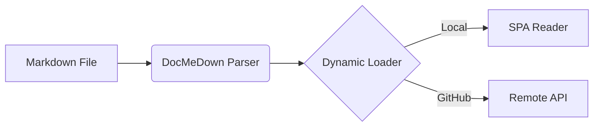

# Markdown, Diagrams & Math Features 📝

DocMeDown is built with full support for GitHub Flavored Markdown (GFM), rich code highlighting, LaTeX math, and interactive architecture diagrams.

---

## 1. GitHub-Style Callout Alerts

Use standard GitHub alert blockquotes:

```markdown
> [!NOTE]
> Informational notes and background context.

> [!TIP]
> Best practices, tips, and optimization ideas.

> [!IMPORTANT]
> Crucial instructions or must-read requirements.

> [!WARNING]
> Warnings regarding common pitfalls and breaking changes.

> [!CAUTION]
> High-risk operations or potential data loss alerts.
```

### Live Rendered Alerts:

> [!NOTE]
> This is a standard informative note callout.

> [!TIP]
> You can toggle dark and light modes with the button in the top navigation bar.

> [!IMPORTANT]
> Ensure all your Markdown files use standard `.md` or `.mdx` extensions.

> [!WARNING]
> Do not commit private API tokens in public repositories.

> [!CAUTION]
> Overwriting existing files during build will replace their contents.

---

## 2. Code Blocks with Titles & Copy Toolbar

Add syntax highlighting, titles, and line headers:

````markdown
```typescript title="src/router.ts"
export class HashRouter {
  constructor(public defaultDoc: string) {}

  public navigate(slug: string) {
    window.location.hash = `#/${slug}`;
  }
}
```
````

```typescript title="src/router.ts"
export class HashRouter {
  constructor(public defaultDoc: string) {}

  public navigate(slug: string) {
    window.location.hash = `#/${slug}`;
  }
}
```

---

## 3. Mermaid Architecture Diagrams

Render flowcharts, sequence diagrams, class diagrams, and state diagrams natively:

````markdown

````


---

## 4. LaTeX Math Formulas (KaTeX)

Render inline math expressions with single dollar signs `$ ... $` like $f(x) = \sin(x) + \cos(x)$ or block equations with `$$ ... $$`:

$$
\mathcal{L}_{G} = \mathbb{E}_{x \sim p_{\text{data}}(x)} [\log D(x)] + \mathbb{E}_{z \sim p_z(z)} [\log (1 - D(G(z)))]
$$

---

## 5. Frontmatter Options

Add YAML frontmatter at the top of any `.md` file to customize metadata and sidebar behavior:

```yaml
---
title: Custom Page Title
sidebar_label: Short Label
order: 1
icon: 🚀
badge: NEW
badge_type: success
tags: [guides, core]
hidden: false
---
```
