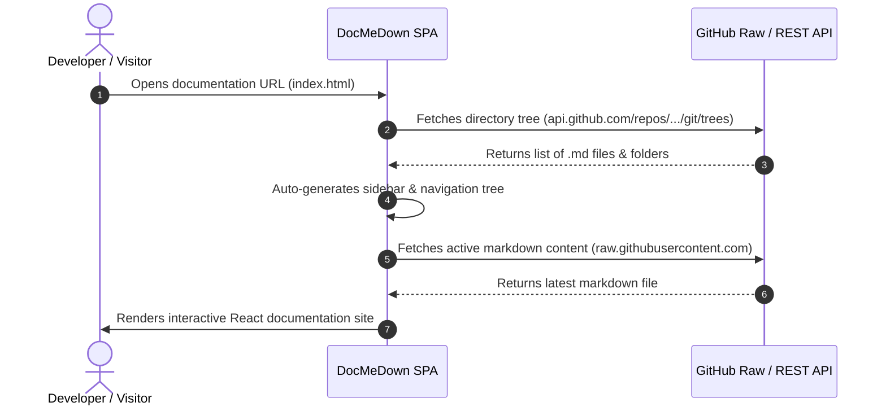

# Dynamic Remote Git Documentation 🌐

One of DocMeDown's most powerful capabilities is **Dynamic Remote Source Mode**.

Instead of committing markdown files to a documentation repository, running CI/CD static generators, or setting up deployment pipelines, you can point DocMeDown directly to any GitHub or GitLab repository!

---

## 🎯 How It Works



Whenever you push commits to your remote GitHub repository, anyone reloading your documentation site **instantly sees the updated documentation** — with zero CI builds or redeployments required!

---

## ⚙️ Setting Up GitHub Remote Mode

Create a `docs.json` file:

```json title="docs.json"
{
  "name": "Live GitHub Docs",
  "source": {
    "type": "github",
    "repo": "facebook/react",
    "branch": "main",
    "docsDir": "docs"
  },
  "theme": {
    "preset": "indigo",
    "defaultMode": "auto"
  }
}
```

### Configuration Fields:
- `type`: `"github"` or `"gitlab"`.
- `repo`: The repository slug in `"owner/repo-name"` format.
- `branch`: Target git branch (e.g. `"main"` or `"master"`).
- `docsDir`: Optional subfolder containing the documentation (e.g. `"docs"` or `""` for repository root).
- `token`: *(Optional)* Personal Access Token for private repositories or to avoid GitHub API rate limits.

---

## 🚀 Hosting Remote Docs

To host this documentation:
1. Upload only `index.html` and `docs.json` to GitHub Pages, Netlify, Vercel, or any static hosting service.
2. That's it! Your documentation website will dynamically fetch and render all documentation directly from your repository on demand.
