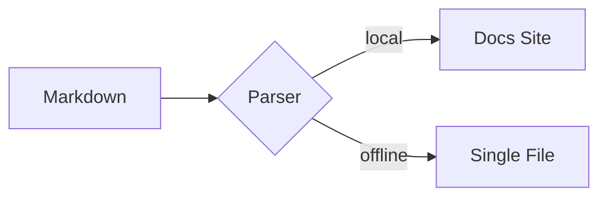

# Markdown Syntax & Component Showcase 🎛️

This page is the living reference for DocMeDown: **every default Markdown feature** and **every built-in component**, each with the copy-pasteable source immediately followed by the component in practice.

---

## Part 1 — Default Markdown Syntax

### Headings & Text

````markdown
# H1 Heading
## H2 Heading
### H3 Heading

**Bold**, *italic*, ~~strikethrough~~, `inline code`, and [links](https://github.com).
````

# H1 Heading
## H2 Heading
### H3 Heading

**Bold**, *italic*, ~~strikethrough~~, `inline code`, and [links](https://github.com).

### Lists & Task Lists

````markdown
- Unordered item
- Another item
  1. Nested ordered
  2. Nested again

- [x] Ship the docs
- [ ] Write more docs
````

- Unordered item
- Another item
  1. Nested ordered
  2. Nested again

- [x] Ship the docs
- [ ] Write more docs

### Tables

````markdown
| Feature     | Status | Notes                     |
| :---------- | :----: | :------------------------ |
| Auto-index  |   ✅   | Zero-config sidebar       |
| Search      |   ✅   | Fuzzy `⌘K` palette        |
| Offline     |   ✅   | Single-file `.dist` build |
````

| Feature    | Status | Notes                     |
| :--------- | :----: | :------------------------ |
| Auto-index |   ✅   | Zero-config sidebar       |
| Search     |   ✅   | Fuzzy `⌘K` palette        |
| Offline    |   ✅   | Single-file `.dist` build |

### Blockquote

````markdown
> Blockquotes render with family-aware accent styling.
````

> Blockquotes render with family-aware accent styling.

### GitHub Alerts

````markdown
> [!NOTE]
> Notes, tips, warnings, and cautions — all five variants supported.
````

> [!NOTE]
> Notes, tips, warnings, and cautions — all five variants supported.

### Math (KaTeX)

Inline math uses single dollars, like $E = mc^2$, and block math uses double dollars:

$$
\int_{-\infty}^{\infty} e^{-x^2}\,dx = \sqrt{\pi}
$$

Math is never parsed inside code spans or fences — `` `$E = mc^2$` `` stays literal code.

### Code Blocks with Titles & Highlighting

Fenced blocks highlight 30+ languages out of the box, with aliases (`ts`, `py`, `sh`, `rb`, `yml`, …) and optional titles:

````markdown
```python title="deploy.py"
def promote(changelog: str, version: str) -> str:
    """Promote Unreleased notes into a dated section."""
    return changelog.replace("## Unreleased", f"## {version}")
```
````

```python title="deploy.py"
def promote(changelog: str, version: str) -> str:
    """Promote Unreleased notes into a dated section."""
    return changelog.replace("## Unreleased", f"## {version}")
```

```rust
fn main() {
    let docs = vec!["fast", "offline", "beautiful"];
    for d in &docs { println!("{}", d); }
}
```

```css title="tokens.css"
:root {
  --dmd-accent: #315cf5;
  --dmd-radius-md: 10px;
}
```

Unknown or missing languages degrade gracefully to plain escaped text instead of false highlighting.

### Mermaid Diagrams

````markdown

````


---

## Part 2 — Built-in Components (12+)

Every component below is registered automatically — no imports, no configuration. Use them directly in any `.md` file.

### 1. `<Tabs>` + `<Tab>` — four treatments, synced groups, icon-only

Tabs support keyboard navigation (arrows / Home / End), `defaultIndex`, `groupId` syncing,
and a `type` prop with four visually distinct looks: `recessed` (default — a pressed-in
well with a raised chip), `underline` (chromeless uppercase micro-labels with a
sliding accent bar), `pills` (a centered floating segmented control), and `postit`
(amber-tinted tilted folder tabs that dock into the panel). `label` is optional — a tab
can be icon-only, and the universal `<Item>` resolves to a `<Tab>` inside `<Tabs>`.

#### Recessed — the default tray

```html
<Tabs type="recessed">
  <Tab label="npm">npm install docmedown</Tab>
  <Tab label="yarn">yarn add docmedown</Tab>
  <Tab label="pnpm">pnpm add docmedown</Tab>
</Tabs>
```

<Tabs type="recessed">
  <Tab label="npm">npm install docmedown</Tab>
  <Tab label="yarn">yarn add docmedown</Tab>
  <Tab label="pnpm">pnpm add docmedown</Tab>
</Tabs>

#### Underline — chromeless editorial micro-labels

```html
<Tabs type="underline" defaultIndex={1}>
  <Tab label="Overview">One screen. Zero build step. Drop Markdown, get docs.</Tab>
  <Tab label="Offline">Every doc ships as a single self-contained HTML file.</Tab>
  <Tab label="AI-Native">llms.txt, SKILL.md, and an MCP server out of the box.</Tab>
</Tabs>
```

<Tabs type="underline" defaultIndex={1}>
  <Tab label="Overview">One screen. Zero build step. Drop Markdown, get docs.</Tab>
  <Tab label="Offline">Every doc ships as a single self-contained HTML file.</Tab>
  <Tab label="AI-Native">llms.txt, SKILL.md, and an MCP server out of the box.</Tab>
</Tabs>

#### Pills — centered floating segmented control

```html
<Tabs type="pills">
  <Tab label="API" icon="🔌">REST + GraphQL endpoints.</Tab>
  <Tab label="CLI" icon="💻">Zero-config commands.</Tab>
  <Tab label="MCP" icon="🤖">Searchable by agents, too.</Tab>
</Tabs>
```

<Tabs type="pills">
  <Tab label="API" icon="🔌">REST + GraphQL endpoints.</Tab>
  <Tab label="CLI" icon="💻">Zero-config commands.</Tab>
  <Tab label="MCP" icon="🤖">Searchable by agents, too.</Tab>
</Tabs>

#### Post-it — warm folder tabs that dock into the panel

```html
<Tabs type="postit">
  <Tab label="API" icon="🔌">REST + GraphQL</Tab>
  <Tab label="CLI" icon="💻">Zero-config commands.</Tab>
  <Tab icon="⚙️">Icon-only, no label.</Tab>
</Tabs>
```

<Tabs type="postit">
  <Tab label="API" icon="🔌">REST + GraphQL</Tab>
  <Tab label="CLI" icon="💻">Zero-config commands.</Tab>
  <Tab icon="⚙️">Icon-only, no label.</Tab>
</Tabs>

#### Synced groups — one selection, everywhere

Tabs sharing a `groupId` switch together (and remember their choice in
`localStorage`) — useful for keeping install-command variants in lockstep:

```html
<Tabs groupId="pkg">
  <Item label="npm">npm install docmedown</Item>
  <Item label="yarn">yarn add docmedown</Item>
  <Item label="pnpm">pnpm add docmedown</Item>
</Tabs>

<Tabs groupId="pkg">
  <Item label="npm">Runs on Node 20.19+.</Item>
  <Item label="yarn">Works with Yarn Berry.</Item>
  <Item label="pnpm">Fastest with pnpm 9+.</Item>
</Tabs>
```

<Tabs groupId="pkg">
  <Item label="npm">npm install docmedown</Item>
  <Item label="yarn">yarn add docmedown</Item>
  <Item label="pnpm">pnpm add docmedown</Item>
</Tabs>

<Tabs groupId="pkg">
  <Item label="npm">Runs on Node 20.19+.</Item>
  <Item label="yarn">Works with Yarn Berry.</Item>
  <Item label="pnpm">Fastest with pnpm 9+.</Item>
</Tabs>


### 2. `<CardGrid>` + `<Card>` (icons, media, badges, footers, free-form bodies, carousel)

Cards work two ways: fully prop-driven (`title` + `description`), or as a container
whose body is arbitrary Markdown or HTML — headings, lists, tables, code fences, and
nested components like `<Badge>` all render inside the card. `title` is optional;
`color` accepts a named variant (`blue`, `green`, `violet`, `amber`, `red`, `neutral`)
or any CSS color (`#ff6600`, `var(--dmd-accent)`, …) applied as the card accent; and
`shadow={false}` opts a card out of its default drop shadow. `description` renders as
a muted subtitle directly under the title; the card body comes only from the element's
children (text, lists, or nothing at all). A card's footer is always pinned to the
bottom edge, even when siblings in the same grid row are taller. A heading-led
body can also name the card itself: with no props, the first heading above `###`
becomes the title, the deeper heading right after it the subtitle, and a trailing
blockquote the footer — an explicit prop always wins for its own slot.

````html
<CardGrid cols={2}>
  <Card
    title="Zero Build Friction"
    description="Drop an index.html and browse."
    badge="Fast"
    badgeType="success"
    icon="⚡"
    footer="Hot-reload included."
  />
  <Card color="blue" badge="New" badgeType="new">
    ## Container-style card
    #### The body is **plain Markdown**:
    - Headings, lists, tables
    - Code fences and math
    ```sh
    npx docmedown init
    ```
    > **Info**: This is a blockquote acting like a footer!
  </Card>
</CardGrid>
````

<CardGrid cols={2}>
  <Card
    title="Zero Build Friction"
    description="Drop an index.html and browse."
    badge="Fast"
    badgeType="success"
    icon="⚡"
    footer="Hot-reload included."
  />
  <Card color="blue" badge="New" badgeType="new">
    ## Container-style card
    #### The body is **plain Markdown**:
    - Headings, lists, tables
    - Code fences and math
    ```sh
    npx docmedown init
    ```
    > **Info**: This is a blockquote acting like a footer!
  </Card>
</CardGrid>

A single accent-colored card, no title required:

```html
<Card color="#8b5cf6">
  Any **CSS color** works as the accent — hex, rgb, or a theme token.
</Card>
```

<Card color="#8b5cf6">
  Any **CSS color** works as the accent — hex, rgb, or a theme token.
</Card>

A flat (shadow-free) card for dense layouts:

```html
<Card title="Flat card" shadow={false}>
  `shadow={false}` removes the drop shadow — handy in sidebars and dense grids.
</Card>
```

<Card title="Flat card" shadow={false}>
  `shadow={false}` removes the drop shadow — handy in sidebars and dense grids.
</Card>

**Carousel mode:** when a grid contains **more cards than columns**, it becomes a
native scroll-snap carousel. Swipe on touch, or use the prev/next buttons and dots.
The window slides one card at a time and **loops through every card**: each card gets
a turn at the front, and the last position wraps back to the first — five cards
two-up walk `1-2`, `2-3`, `3-4`, `4-5`, `5-1`, so card 5 leads its own window and the
trailing slide carries the loop round to the start (the wrap clones the cards it
needs, so the window is never half empty and the last position is reachable at all).
`carouselCols` caps how many cards are visible at once (defaults to `cols`) and
auto-shrinks on narrow screens.

```html
<CardGrid cols={2} carouselCols={2}>
  <Card color="blue" title="One" icon="1️⃣">Slide the controls below.</Card>
  <Card color="green" title="Two" icon="2️⃣">Swipe or use the arrows.</Card>
  <Card color="amber" title="Three" icon="3️⃣">Dots jump straight to a card.</Card>
  <Card color="violet" title="Four" icon="4️⃣">Last-to-first glides seamlessly.</Card>
  <Card color="red" title="Five" icon="5️⃣">Narrow screens show one at a time.</Card>
</CardGrid>
```

<CardGrid cols={2} carouselCols={2}>
  <Card color="blue" title="One" icon="1️⃣">Slide the controls below.</Card>
  <Card color="green" title="Two" icon="2️⃣">Swipe or use the arrows.</Card>
  <Card color="amber" title="Three" icon="3️⃣">Dots jump straight to a card.</Card>
  <Card color="violet" title="Four" icon="4️⃣">Last-to-first glides seamlessly.</Card>
  <Card color="red" title="Five" icon="5️⃣">Narrow screens show one at a time.</Card>
</CardGrid>

### 3. `<Steps>` + `<Step>`

`step` numbers are optional — Steps auto-numbers each step in order, so you can leave the markers to the component:

```html
<Steps>
  <Step title="Initialize">Run <code>npx docmedown ./docs</code></Step>
  <Step title="Author">Write Markdown, get navigation and search for free.</Step>
  <Step title="Deploy">Static host or single-file offline bundle.</Step>
</Steps>
```

<Steps>
  <Step title="Initialize">Run <code>npx docmedown ./docs</code></Step>
  <Step title="Author">Write Markdown, get navigation and search for free.</Step>
  <Step title="Deploy">Static host or single-file offline bundle.</Step>
</Steps>

### 4. `<Badge>` (six types, pill, live dot, icon)

Six semantic types (`info`, `success`, `warning`, `danger`, `new`, `neutral`) render as
soft tinted labels with a subtle matching glow. Add `pill` for a more prominent
**outlined** chip, `dot` for a pulsing status indicator, or `icon` for a leading glyph:

```html
<Badge type="info">INFO</Badge>
<Badge type="success">STABLE</Badge>
<Badge type="warning">BETA</Badge>
<Badge type="danger">CRITICAL</Badge>
<Badge type="new">v1.0</Badge>
<Badge type="neutral" pill>NEUTRAL PILL</Badge>
<Badge type="success" dot>Live</Badge>
```

<Badge type="info">INFO</Badge> <Badge type="success">STABLE</Badge> <Badge type="warning">BETA</Badge> <Badge type="danger">CRITICAL</Badge> <Badge type="new">v1.0</Badge> <Badge type="neutral" pill>NEUTRAL PILL</Badge> <Badge type="success" dot>Live</Badge>

### 5. `<Alert>` (+ `<Callout>` alias)

Eight semantic types (`note`, `tip`, `important`, `warning`, `caution`, `info`, `success`,
`danger`). Each alert renders a colored icon chip + title header over a tinted, softly-glowing
card in the type's hue. The same styling applies to GitHub-style `> [!NOTE]` callouts.

```html
<Alert type="tip" title="Pro tip">Alerts take eight types: note, tip, important, warning, caution, info, success, danger.</Alert>
<Alert type="danger" title="Breaking change">Always rebuild offline copies after upgrading the runtime.</Alert>
```

<Alert type="tip" title="Pro tip">Alerts take eight types: note, tip, important, warning, caution, info, success, danger.</Alert>

<Alert type="danger" title="Breaking change">Always rebuild offline copies after upgrading the runtime.</Alert>

### 6. `<Button>` (variants, sizes, danger, loading, icons)

```html
<Button href="#/getting-started">Get Started</Button>
<Button variant="outline" href="#/configuration">Configuration</Button>
<Button variant="secondary" size="sm">Secondary</Button>
<Button variant="ghost" size="sm">Ghost</Button>
<Button variant="danger" size="sm">Delete</Button>
<Button variant="primary" loading>Deploying…</Button>
<Button variant="primary" size="lg" href="https://github.com/gabrielmsilva00/docmedown" external>GitHub ↗</Button>
```

<Button href="#/getting-started">Get Started</Button> <Button variant="outline" href="#/configuration">Configuration</Button> <Button variant="secondary" size="sm">Secondary</Button> <Button variant="ghost" size="sm">Ghost</Button> <Button variant="danger" size="sm">Delete</Button> <Button variant="primary" loading>Deploying…</Button> <Button variant="primary" size="lg" href="https://github.com/gabrielmsilva00/docmedown" external>GitHub ↗</Button>

### 7. `<Kbd>` (single keys and full shortcuts)

```html
Press <Kbd>Ctrl</Kbd> + <Kbd>K</Kbd> anywhere to open the search palette.
Full shortcut: <Kbd keys="Ctrl + K" />
```

Press <Kbd>Ctrl</Kbd> + <Kbd>K</Kbd> anywhere to open the search palette.
Full shortcut: <Kbd keys="Ctrl + K" />

### 8. `<Details>`

```html
<Details summary="How does the offline bundle work?">
  The build gzips your corpus, components, and runtime into one base64 envelope
  that self-extracts with the browser's native DecompressionStream.
</Details>
```

<Details summary="How does the offline bundle work?">
  The build gzips your corpus, components, and runtime into one base64 envelope
  that self-extracts with the browser's native DecompressionStream.
</Details>

### 9. `<Accordion>` + `<AccordionItem>`

```html
<Accordion>
  <AccordionItem title="Is DocMeDown free?">Yes — MIT licensed, forever.</AccordionItem>
  <AccordionItem title="Does it work offline?" defaultOpen={true}>Fully. One HTML file, zero network.</AccordionItem>
  <AccordionItem title="Can I add my own widgets?">Yes, via .dmd/components.js or DocMeDown.registerComponent.</AccordionItem>
</Accordion>
```

<Accordion>
  <AccordionItem title="Is DocMeDown free?">Yes — MIT licensed, forever.</AccordionItem>
  <AccordionItem title="Does it work offline?" defaultOpen={true}>Fully. One HTML file, zero network.</AccordionItem>
  <AccordionItem title="Can I add my own widgets?">Yes, via .dmd/components.js or DocMeDown.registerComponent.</AccordionItem>
</Accordion>

### 10. `<Columns>` + `<Column>`

`type` picks the column treatment: `normal` (default, borderless/flush), `card` (elevated panel),
`recessed` (inset tray), or `neon` (accent outline + glow). Grids stay responsive, collapsing
to fewer columns as the viewport narrows.

```html
<Columns cols={3}>
  <Column>**Author** in plain Markdown.</Column>
  <Column>**Theme** with four complete families.</Column>
  <Column>**Ship** anywhere — static or offline.</Column>
</Columns>

<Columns cols={3} type="card">
  <Column>Card treatment — elevated panel with border + shadow.</Column>
  <Column>Card treatment — elevated panel with border + shadow.</Column>
  <Column>Card treatment — elevated panel with border + shadow.</Column>
</Columns>

<Columns cols={3} type="recessed">
  <Column>Recessed — inset tray sitting below the surface.</Column>
  <Column>Recessed — inset tray sitting below the surface.</Column>
  <Column>Recessed — inset tray sitting below the surface.</Column>
</Columns>

<Columns cols={3} type="neon">
  <Column>Neon — accent outline with a soft glow.</Column>
  <Column>Neon — accent outline with a soft glow.</Column>
  <Column>Neon — accent outline with a soft glow.</Column>
</Columns>
```

<Columns cols={3}>
  <Column>**Author** in plain Markdown.</Column>
  <Column>**Theme** with four complete families.</Column>
  <Column>**Ship** anywhere — static or offline.</Column>
</Columns>

<Columns cols={3} type="card">
  <Column>Card treatment — elevated panel with border + shadow.</Column>
  <Column>Card treatment — elevated panel with border + shadow.</Column>
  <Column>Card treatment — elevated panel with border + shadow.</Column>
</Columns>

<Columns cols={3} type="recessed">
  <Column>Recessed — inset tray sitting below the surface.</Column>
  <Column>Recessed — inset tray sitting below the surface.</Column>
  <Column>Recessed — inset tray sitting below the surface.</Column>
</Columns>

<Columns cols={3} type="neon">
  <Column>Neon — accent outline with a soft glow.</Column>
  <Column>Neon — accent outline with a soft glow.</Column>
  <Column>Neon — accent outline with a soft glow.</Column>
</Columns>

### 11. `<Timeline>` + `<TimelineItem>`

```html
<Timeline>
  <TimelineItem title="0.1.7 — Offline self-containment" subtitle="2026-08-30">
    Nested sites embed into the single-file bundle; blocked links grey out.
  </TimelineItem>
  <TimelineItem title="0.1.6 — Single-line navbar" subtitle="2026-08-30">
    Every navbar element stays on one row with ellipsis truncation.
  </TimelineItem>
  <TimelineItem title="0.1.0 — First release" subtitle="2026-08-27">
    Markdown in, beautiful docs out.
  </TimelineItem>
</Timeline>
```

<Timeline>
  <TimelineItem title="0.1.7 — Offline self-containment" subtitle="2026-08-30">
    Nested sites embed into the single-file bundle; blocked links grey out.
  </TimelineItem>
  <TimelineItem title="0.1.6 — Single-line navbar" subtitle="2026-08-30">
    Every navbar element stays on one row with ellipsis truncation.
  </TimelineItem>
  <TimelineItem title="0.1.0 — First release" subtitle="2026-08-27">
    Markdown in, beautiful docs out.
  </TimelineItem>
</Timeline>

### 12. The Universal `<Item>`

`<Item>` works as the child of every paired container — it resolves to the **nearest**
container above it and inherits that child's full behaviour and props. With no container
it becomes a plain `<li>`. Here it drives a `Timeline`, a `Steps`, and an `Accordion`:

```html
<Timeline>
  <Item title="0.1.7 — Offline self-containment" subtitle="2026-08-30">
    Nested sites embed into the single-file bundle.
  </Item>
  <Item title="0.1.6 — Single-line navbar" subtitle="2026-08-30">
    Every navbar element stays on one row.
  </Item>
</Timeline>

<Steps>
  <Item>Run <code>npx docmedown ./docs</code></Item>
  <Item>Write Markdown, get navigation and search for free.</Item>
  <Item>Deploy anywhere.</Item>
</Steps>

<Accordion>
  <Item title="Is DocMeDown free?" defaultOpen>Yes — MIT licensed, forever.</Item>
  <Item title="Does it work offline?">Fully. One HTML file, zero network.</Item>
</Accordion>
```

<Timeline>
  <Item title="0.1.7 — Offline self-containment" subtitle="2026-08-30">
    Nested sites embed into the single-file bundle.
  </Item>
  <Item title="0.1.6 — Single-line navbar" subtitle="2026-08-30">
    Every navbar element stays on one row.
  </Item>
</Timeline>

<Steps>
  <Item>Run <code>npx docmedown ./docs</code></Item>
  <Item>Write Markdown, get navigation and search for free.</Item>
  <Item>Deploy anywhere.</Item>
</Steps>

<Accordion>
  <Item title="Is DocMeDown free?" defaultOpen>Yes — MIT licensed, forever.</Item>
  <Item title="Does it work offline?">Fully. One HTML file, zero network.</Item>
</Accordion>

---

## Part 3 — Your Own Components (`.dmd/`)

Author first-class Svelte 5 components as `.svelte` files under `.dmd/` — compiled ahead-of-time during build for zero-overhead static distribution, and dynamically compiled at runtime when developing. These two live widgets ship with this very site:

```svelte title=".dmd/CounterWidget.svelte"
<svelte:options customElement={{ tag: "dmd-counter-widget" }} />

<script>
  let { title = "Counter" } = $props();
  let count = $state(0);
</script>

<div class="dmd-custom-panel">
  <strong>{title}</strong>
  <p class="dmd-custom-desc">
    A component-local reactive state value using Svelte 5 runes.
  </p>
  <button type="button" class="dmd-custom-btn" onclick={() => count++}>
    Count: {count}
  </button>
</div>
```

<InteractiveThemeDemo />

<CounterWidget title="Live state widget" />

### Custom Syntax-Highlighting Languages

Register a Prism grammar at runtime for languages that are not bundled:

```js title=".dmd/components.js"
window.DocMeDown.registerLanguage("mylang", {
  comment: /#.*/,
  string: /"(?:[^"\\]|\\.)*"/,
  keyword: /\b(?:draw|plot|render)\b/,
  number: /\b\d+(?:\.\d+)?\b/,
});
```

Then use it with `mylang` fenced code blocks anywhere in your documentation.

---

> [!TIP]
> Copy any source block above straight into your own docs — every component and syntax feature on this page works identically in serveable sites and single-file offline bundles.