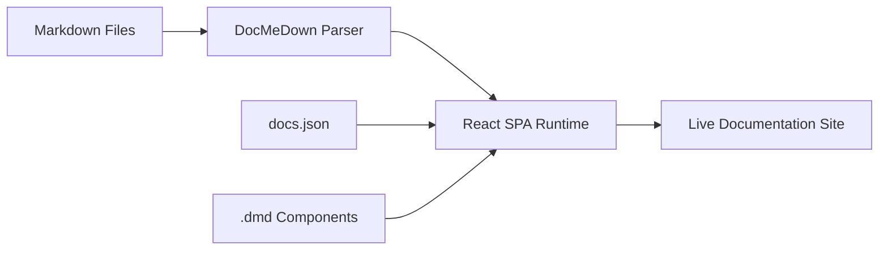

# Welcome to DocMeDown ⚡

**DocMeDown** is the simplest Markdown documentation system yet. Drop an `index.html` file into any folder of Markdown files, and you have a fully-featured, blazing fast documentation website.

> [!TIP]
> **Zero Configuration Required**: DocMeDown automatically indexes all your `.md` files and subfolders into categories, builds navigation, and enables instant search out of the box!

---

## Key Features

- **🚀 Zero Build Friction**: Host statically, build a self-contained `.dist/index.html` for `file:///`, or document remote GitHub/GitLab repositories dynamically.
- **🎨 Complete Theme Families**: Atlas, Blueprint, Terminal, and Editorial each provide distinct surfaces, geometry, typography, spacing, and diagram palettes across light and dark modes.
- **⚡ Fast Search**: In-browser fuzzy search with `⌘K` command palette.
- **⚛️ React Components**: Support for custom React components via `.dmd/` global registry or ready-to-use builtins.
- **📊 Diagrams & Math**: A theme-aware Mermaid viewer with Fit, zoom, SVG export, and offline parity, plus KaTeX formulas.

---

## Architecture Flow

---

## Interactive Features Demo

### 1. GitHub-style Callouts

> [!NOTE]
> This is a standard informative note callout.

> [!IMPORTANT]
> Important guidelines or critical notices use the active family's semantic emphasis colors.

> [!WARNING]
> Warnings help developers avoid common pitfalls and mistakes.

---

### 2. Math Formulas

You can write inline math like $E = mc^2$ or block LaTeX math equations:

$$
\int_{-\infty}^{\infty} e^{-x^2} dx = \sqrt{\pi}
$$

---

## Next Steps

Check out the [Quickstart Guide](./getting-started.md) to learn how to add your own pages and customize your site.
